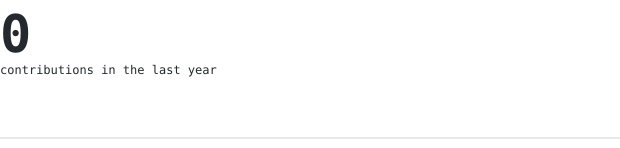

[github](https://github.com/msaimnaveed2005) &nbsp;/&nbsp;
[repositories](https://github.com/msaimnaveed2005?tab=repositories)

> Bachelor of Science in Software Engineering at FAST University, Chiniot-Faisalabad Campus 
> Software developer focused on Python, C++, TypeScript, JavaScript, and data structures 
> Building practical applications while developing strong software engineering fundamentals 
> Pakistan

<samp>Python &nbsp; C++ &nbsp; TypeScript &nbsp; JavaScript &nbsp; React &nbsp; Tailwind CSS &nbsp; Git</samp>

**Core projects** &nbsp;/&nbsp; <samp>C++, Python, data structures</samp> 
[E-Commerce System](https://github.com/msaimnaveed2005/E-COMMERCE-MANAGEMENT-SYSTEM) | [ATC Simulation](https://github.com/msaimnaveed2005/SkyNet-ATC) | [Snake Game 3D](https://github.com/msaimnaveed2005/SnakeGame3D) 
Applications demonstrating object-oriented design, file I/O, simulation, and game programming.

**Web development** &nbsp;/&nbsp; <samp>React, TypeScript, JavaScript, Tailwind CSS</samp> 
[Cinematic Website](https://github.com/msaimnaveed2005/softsol-cinematic-website) | [Backend Course](https://github.com/msaimnaveed2005/Backend-Full-Course-Practice) | [Tailwind Master](https://github.com/msaimnaveed2005/Master-TailwindCSS) 
Frontend and backend practice focused on responsive interfaces, reusable components, and modern tooling.

**Algorithms and data structures** &nbsp;/&nbsp; <samp>C++, problem solving</samp> 
[Data Structures (Sem 3)](https://github.com/msaimnaveed2005/Data-Structure-SEMESTER-3-2025) | [OOP Projects](https://github.com/msaimnaveed2005/OOP-FALL-2024) | [Discrete Structures](https://github.com/msaimnaveed2005/DiscreteFinalProject) 
Coursework covering algorithms, object-oriented programming, discrete mathematics, and software design.

- Improving full-stack development with React, TypeScript, and backend fundamentals
- Strengthening data structures, algorithms, and problem-solving skills
- Designing maintainable applications with clear architecture
- Building and documenting projects that demonstrate practical engineering ability
- Learning modern development tools and software engineering practices

The portrait and profile graphics are generated inside this repository. A scheduled
GitHub Action refreshes the contribution graphics using GitHub's GraphQL API and
commits only changed files, so the profile does not depend on third-party widgets.
The stats include contribution history, streaks, public-repository languages, and
a one-character-per-day activity map.

Learning, building, and improving one project at a time.

